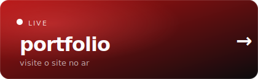
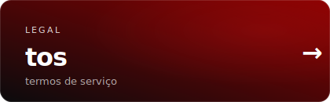
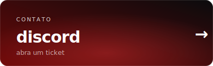

# s0da

> meu portfolio de design de thumbnails roblox · 2.3b+ visitas influenciadas


<p>
  <a href="https://gfxs0da.com/"></a>
  <a href="https://gfxs0da.com/tos.html"></a>
  <a href="https://discord.gg/s0da"></a>
</p>

---

## sobre

site pessoal de portfolio. atualmente artista 3d na [rubicon games](https://rubiconstudios.io/). designer de thumbnails roblox desde 2020, com mais de 2 bilhões de visitas influenciadas e 200+ commissions entregues. esse repo é o single-page portfolio + uma subpágina pra termos de serviço, ambos estáticos puros, sem backend, sem framework.

## seções

— **hero** — 5 fileiras de thumbs scrollando em direções alternadas com perspective tilt. textos entram com fade + redução de blur em cascata. headline "2 billion clicks. yours next." com gradient vermelho. stats em strip de vidro com distorção svg, contador animado no load (2.3b+ subindo do zero).

— **work** — grid 16:9 de 6 cards. 3 deles (apoc, prospecting, parkour) têm carrossel multi-variante embutido — hover mostra setas + badge "1/4". click abre lightbox em fullscreen com navegação por teclado (← → esc).

— **about** — bio em 2 colunas com heading sticky à esquerda. lista de capabilities + chips dos estúdios atuais.

— **process** — explicação do meu fluxo de commission via discord ticket + mock interativo do chat. 9 mensagens animadas com indicador "is typing" entre elas, badges client/staff, avatar com minha pfp. card tem tilt 3d que segue o cursor + glow vermelho radial acompanhando o mouse.

— **trust** — 4 counters fazem count-up animado quando entram na viewport (2.3b+, 200+, ~48h, 5★). estrelas pipocam em sequência com flash de glow vermelho. abaixo, 3 testimonials reais de clientes meus.

— **pricing** — 4 tiers (thumbnail 35k robux / icon novo 17.5k / priority +50% / rescale 5k). hover destaca um card e aplica blur+brightness baixa nos outros.

— **cta** — call final com 3 botões: open ticket / see work first / read terms first.

## extras

— smooth scroll com inércia tipo manteiga (lerp 0.10)
— ambient particles + mouse glow globais
— film grain svg overlay sutil
— marquee horizontal entre hero e work
— lightbox com backdrop blur e teclado
— subpágina de tos com toc sticky e scroll spy, 15 seções deep-linkáveis (`tos.html#refunds`, etc)
— responsive até mobile, respeita `prefers-reduced-motion`

## tech

html5 · css puro (custom properties, `:has()`, `backdrop-filter`, svg filters) · js vanilla · webp via [sharp](https://sharp.pixelplumbing.com/) · fontes inter tight · inter · jetbrains mono · host github pages

## estrutura

```
.
├── index.html             ← portfolio
├── tos.html               ← termos de serviço
├── styles.css             ← todo o estilo
├── script.js              ← interações
├── optimize-images.js     ← converte pngs/jpgs novos em webp
├── record-hero.js         ← grava o gif animado do hero pra preview.gif
└── assets/
    ├── favicon.svg
    ├── pfp.png
    ├── preview.gif        ← gif animado do hero pro readme
    ├── readme/            ← cards animados svg
    └── work/
        ├── *.webp         ← thumbs servidas
        └── works.txt
```

## rodando local

```bash
python -m http.server 8000
# ou
npx serve
```

## adicionando thumbs novas

1. dropa png/jpg em `assets/work/`
2. roda o otimizador (na primeira vez: `npm install`):
   ```bash
   node optimize-images.js
   ```
3. referencia o `.webp` novo no `index.html`

## deploy

push pra `main` → github pages re-deploya em ~30-60s.

```bash
git add .
git commit -m "msg"
git push
```

## licença

todos os direitos reservados. o código é visível porque sites estáticos são naturalmente públicos pro browser, mas o design, código e visuais são meus. não autorizado pra reuso, redistribuição ou como template pra portfolios derivados.
